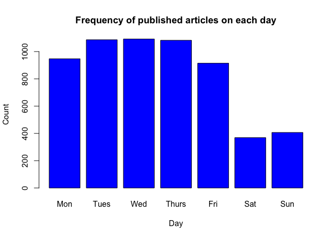

Online News Popularity Analysis
================
Rina Deka and Jessica Ayers
2023-06-29

# Introduction

**RINA**

*You should have an introduction section that briefly describes the data
and the variables you have to work with (just discuss the ones you want
to use). Your target variables is the shares variable.*

*You should also mention the purpose of your analysis and the methods
you’ll use to model the response. You’ll describe those in more detail
later.*

# Data

**RINA or JESS**

*Use a relative path to import the data. Subset the data to work on the
data channel of interest.*

``` r
library(tidyverse)
#import data set
#my data set is stored in the folder above where I have the project 2 folder
onpdata <- read_csv("../OnlineNewsPopularity/OnlineNewsPopularity.csv")
#find names of variables
attributes(onpdata)$names
```

    ##  [1] "url"                           "timedelta"                    
    ##  [3] "n_tokens_title"                "n_tokens_content"             
    ##  [5] "n_unique_tokens"               "n_non_stop_words"             
    ##  [7] "n_non_stop_unique_tokens"      "num_hrefs"                    
    ##  [9] "num_self_hrefs"                "num_imgs"                     
    ## [11] "num_videos"                    "average_token_length"         
    ## [13] "num_keywords"                  "data_channel_is_lifestyle"    
    ## [15] "data_channel_is_entertainment" "data_channel_is_bus"          
    ## [17] "data_channel_is_socmed"        "data_channel_is_tech"         
    ## [19] "data_channel_is_world"         "kw_min_min"                   
    ## [21] "kw_max_min"                    "kw_avg_min"                   
    ## [23] "kw_min_max"                    "kw_max_max"                   
    ## [25] "kw_avg_max"                    "kw_min_avg"                   
    ## [27] "kw_max_avg"                    "kw_avg_avg"                   
    ## [29] "self_reference_min_shares"     "self_reference_max_shares"    
    ## [31] "self_reference_avg_sharess"    "weekday_is_monday"            
    ## [33] "weekday_is_tuesday"            "weekday_is_wednesday"         
    ## [35] "weekday_is_thursday"           "weekday_is_friday"            
    ## [37] "weekday_is_saturday"           "weekday_is_sunday"            
    ## [39] "is_weekend"                    "LDA_00"                       
    ## [41] "LDA_01"                        "LDA_02"                       
    ## [43] "LDA_03"                        "LDA_04"                       
    ## [45] "global_subjectivity"           "global_sentiment_polarity"    
    ## [47] "global_rate_positive_words"    "global_rate_negative_words"   
    ## [49] "rate_positive_words"           "rate_negative_words"          
    ## [51] "avg_positive_polarity"         "min_positive_polarity"        
    ## [53] "max_positive_polarity"         "avg_negative_polarity"        
    ## [55] "min_negative_polarity"         "max_negative_polarity"        
    ## [57] "title_subjectivity"            "title_sentiment_polarity"     
    ## [59] "abs_title_subjectivity"        "abs_title_sentiment_polarity" 
    ## [61] "shares"

``` r
#want to subset to one category of data_channel_is*
#using data_channel_is_world for the primary analysis
onpdata_world <- subset(onpdata, data_channel_is_world == 1)
# onpdata_lifestyle <- subset(onpdata, data_channel_is_lifestyle == 1)
# onpdata_entertainment <- subset(onpdata, data_channel_is_entertainment == 1)
# onpdata_bus <- subset(onpdata, data_channel_is_bus == 1)
# onpdata_socmed <- subset(onpdata, data_channel_is_socmed == 1)
# onpdata_tech <- subset(onpdata, data_channel_is_tech == 1)

#check that subset is correct
head(onpdata_world$data_channel_is_world)
```

    ## [1] 1 1 1 1 1 1

# Summarizations

\*\*RINA and JESS

``` r
#create training and test data set
library(caret)
set.seed(111)
trainIndex <- createDataPartition(onpdata_world$shares, p = 0.7, list = FALSE) 
worldTrain <- onpdata_world[trainIndex, ]
worldTest <- onpdata_world[-trainIndex, ]
```

*You should produce some basic (but meaningful) summary statistics and
plots about the training data you are working with (especially as it
relates to your response).*

``` r
summary(worldTrain$shares)
```

    ##    Min. 1st Qu.  Median    Mean 3rd Qu.    Max. 
    ##      41     827    1100    2272    1900  128500

The above summary provides the minimum, maximum, median, and mean of the
number of shares in the training data. The first and third quantile are
also included.

Since our response variable is the number of shares, we can first look
at when the articles were published and the frequency for each day.

``` r
m <- sum(worldTrain$weekday_is_monday)
tu <- sum(worldTrain$weekday_is_tuesday)
wed <- sum(worldTrain$weekday_is_wednesday)
th <- sum(worldTrain$weekday_is_thursday)
f <- sum(worldTrain$weekday_is_friday)
sat <- sum(worldTrain$weekday_is_saturday)
sun <-sum(worldTrain$weekday_is_sunday)
data.frame(monday = m, tuesday = tu, wednesday = wed, thursday = th, friday = f, saturday = sat, sunday = sun)
```

    ##   monday tuesday wednesday thursday friday saturday sunday
    ## 1    947    1087      1092     1083    915      369    407

``` r
days <- c(m, tu, wed, th, f, sat, sun)
```

From the above sums we can identify which day has the largest amount of
published articles. We can visualize this by creating a bar graph as
seen below.

``` r
plot <- barplot(days, main = "Frequency of published articles on each day", ylab = "Count", xlab = "Day",names.arg = c("Mon", "Tues", "Wed", "Thurs", "Fri", "Sat", "Sun"), col = "blue")
```



We can also look at different attributes that the articles have such as
number of images and number of number of videos. We can explore if there
are more shares with more images or videos.

``` r
worldTrain %>%
  group_by(num_imgs, num_videos) %>%
  summarise(mean = mean(shares), sd = sd(shares))
```

    ## `summarise()` has grouped output by 'num_imgs'. You can override using the `.groups` argument.

    ## # A tibble: 169 × 4
    ## # Groups:   num_imgs [45]
    ##    num_imgs num_videos   mean     sd
    ##       <dbl>      <dbl>  <dbl>  <dbl>
    ##  1        0          0  2377.  3254.
    ##  2        0          1  3017.  6217.
    ##  3        0          2  4857. 14080.
    ##  4        0          3  7825. 13956.
    ##  5        0          4 12100     NA 
    ##  6        0          5  5900     NA 
    ##  7        0          6  1500     NA 
    ##  8        0          8  1100     NA 
    ##  9        0          9  1967.   776.
    ## 10        0         10  2400   1556.
    ## # ℹ 159 more rows

Let’s visualize this. First for number of images:

``` r
ggplot(worldTrain, aes(x = num_imgs, y = shares)) +
  geom_point() +
    geom_smooth(method = "lm", col = "green") + 
  geom_smooth() + 
   labs(title = "Number of Shares vs Number of Images", x = "Number of Images", y = "Number of Shares")
```

    ## `geom_smooth()` using formula = 'y ~ x'
    ## `geom_smooth()` using method = 'gam' and formula = 'y ~ s(x, bs = "cs")'

<!-- -->

From the above plot if the trend shows a positive linear line, as number
of images included in the article increases as does the number of
shares. If it shows a negative linear line, the number of shares
decreases with the addition of images. If no trend is shown, the number
of images included has no impact on overall shares.

For number of videos:

``` r
ggplot(worldTrain, aes(x = num_videos, y = shares)) +
  geom_point() + 
  geom_smooth(method = "lm", col = "green") + 
  geom_smooth() + 
  labs(title = "Number of Shares vs Number of Videos", x = "Number of Videos", y = "Number of Shares")
```

    ## `geom_smooth()` using formula = 'y ~ x'
    ## `geom_smooth()` using method = 'gam' and formula = 'y ~ s(x, bs = "cs")'

<!-- -->

Similar to above, from the above plot if the trend shows a positive
linear line, as number of videos included in the article increases as
does the number of shares. If it shows a negative linear line, the
number of shares decreases with the addition of videos If no trend is
shown, the number of videos included has no impact on overall shares.

*As you will automate this same analysis across other data, you can’t
describe the trends you see in the graph (unless you want to try to
automate that!). You should describe what to look for in the summary
statistics/plots to help the reader understand the summary or graph.*

# Modeling

**RINA: linear regression & boosted tree model & explanation of the
ensemble model you are using**

**JESS: linear regression & random forest model & explanation of the
idea of a linear regression model & explanation of the ensemble model
you are using**

``` r
library(randomForest)
#using cross validation
ncol(worldTrain)
rfFit <- train(shares ~ ., data = worldTrain, method = "rf", 
               trControl = trainControl(method = "cv", number = 5), 
               tuneGrid = data.frame(mtry = 1:60))
rfFit$results
rfFit$bestTune
rfPred <- predict(rfFit, newdata = worldTest)
postResample(rfPred, worldTest$shares)
```

*You’ll need to split the data into a training (70% of the data) and
test set (30% of the data). Use set.seed() to make things reproducible.*

*The goal is to create models for predicting the number of shares in
some way.*

*Each group member should contribute a linear regression model and an
ensemble tree-based model. As we are automating things, describing the
chosen model is tough, so no need to worry about that.*

*Both models should be chosen using cross-validation.*

## Comparison

**RINA or JESS**

*All four of the models should be compared on the test set and a winner
declared (this should be automated to be correct across all the created
documents).*

``` r
#c(lin1 = lin1RMSE, lin2 = lin2RMSE, rf = rfRMSE, boost = boostRMSE)
```

# Automation

**RINA or JESS**

*Once you’ve completed the above for a particular data channel, adapt
the code so that you can use a parameter in your build process. You
should be able to automatically generate an analysis report for each
data_channel_is\_ variable*

*You’ll end up with six total outputted documents.*
